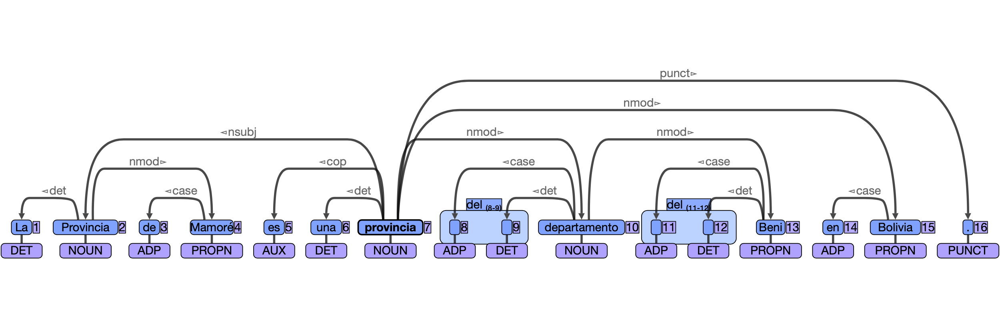

# Train, parse and evaluate using UDPipe - Report
## Practical 04-A
## Santiago Arróniz

#### UD_Spanish-GSD

For this task, I used a Spanish data set obtained from [https://github.com/UniversalDependencies/UD_Spanish-GSD](https://github.com/UniversalDependencies/UD_Spanish-GSD).

First, I trained UDPipe tagger using the file `es_gsd-ud-train.conllu`. After that, I run the tagger with `es_gsd-ud-test.conllu`. It evaluated the output using the same python script as before (CoNLL-2017 evaluation script).

```
# Train a model on the -train portion of the UD_Spanish-TDT treebank, and test it on the -test portion.
$ udpipe  --tokenizer none --tagger none --train es.udpipe < es_gsd-ud-train.conllu

# Use the output from previous command to parse the test data
$ udpipe --parse es.udpipe < es_gsd-ud-test.conllu > es_gsd-ud-test_output.conllu

# Use the script to evaluate the performance of the parser.
$ python3 conll17_ud_eval.py --verbose es_gsd-ud-test.conllu es_gsd-ud-test_output.conllu
```
These are the results for the analysis:

    Metrics    | Precision |    Recall |  F1 Score | AligndAcc
    -----------+-----------+-----------+-----------+-----------
    Tokens     |    100.00 |    100.00 |    100.00 |
    Sentences  |    100.00 |    100.00 |    100.00 |
    Words      |    100.00 |    100.00 |    100.00 |
    UPOS       |    100.00 |    100.00 |    100.00 |    100.00
    XPOS       |    100.00 |    100.00 |    100.00 |    100.00
    Feats      |    100.00 |    100.00 |    100.00 |    100.00
    AllTags    |    100.00 |    100.00 |    100.00 |    100.00
    Lemmas     |    100.00 |    100.00 |    100.00 |    100.00
    UAS        |     85.67 |     85.67 |     85.67 |     85.67
    LAS        |     82.38 |     82.38 |     82.38 |     82.38


# sent_id = es-dev-003-s415
# text = La Provincia de Mamoré es una provincia del departamento del Beni en Bolivia.
```
1	La	el	DET	_	Definite=Def|Gender=Fem|Number=Sing|PronType=Art	2	det	_	_
2	Provincia	provincia	NOUN	_	_	7	nsubj	_	_
3	de	de	ADP	_	_	4	case	_	_
4	Mamoré	mamoré	PROPN	_	_	2	nmod	_	_
5	es	ser	AUX	_	Mood=Ind|Number=Sing|Person=3|Tense=Pres|VerbForm=Fin	7	cop	_	_
6	una	uno	DET	_	Definite=Ind|Gender=Fem|Number=Sing|PronType=Art	7	det	_	_
7	provincia	provincia	NOUN	_	Gender=Fem|Number=Sing	0	root	_	_
8-9	del	_	_	_	_	_	_	_	_
8	_	de	ADP	_	_	10	case	_	_
9	_	el	DET	_	Definite=Def|Gender=Masc|Number=Sing|PronType=Art	10	det	_	_
10	departamento	departamento	NOUN	_	Gender=Masc|Number=Sing	7	nmod	_	_
11-12	del	_	_	_	_	_	_	_	_
11	_	de	ADP	_	_	13	case	_	_
12	_	el	DET	_	Definite=Def|Gender=Masc|Number=Sing|PronType=Art	13	det	_	_
13	Beni	beni	PROPN	_	_	10	nmod	_	_
14	en	en	ADP	_	_	15	case	_	_
15	Bolivia	bolivia	PROPN	_	_	7	nmod	_	_
16	.	.	PUNCT	_	_	7	punct	_	_
```




This sentence seems to be accurate in the analysis. The verb "ser" is parsed correctly: it depends directly on the noun "provincia". The three ADPs are connected correctly with their nucleus. There seems to be no issues in this analysis.

# sent_id = es-dev-003-s417
# text = Su actuación recibió buenas reseñas, al igual que el filme.
```
1	Su	su	DET	_	Number=Sing|Person=3|Poss=Yes|PronType=Prs	2	det	_	_
2	actuación	actuación	NOUN	_	Gender=Fem|Number=Sing	3	nsubj	_	_
3	recibió	recibir	VERB	_	Mood=Ind|Number=Sing|Person=3|Tense=Past|VerbForm=Fin	0	root	_	_
4	buenas	buen	ADJ	_	Gender=Fem|Number=Plur	5	amod	_	_
5	reseñas	reseño	NOUN	_	Gender=Fem|Number=Plur	3	obj	_	SpaceAfter=No
6	,	,	PUNCT	_	_	3	punct	_	_
7-8	al	_	_	_	_	_	_	_	_
7	a	a	ADP	_	_	12	case	_	_
8	el	el	DET	_	Definite=Def|Gender=Masc|Number=Sing|PronType=Art	9	det	_	_
9	igual	igual	ADJ	_	Number=Sing	7	fixed	_	_
10	que	que	CCONJ	_	_	7	fixed	_	_
11	el	el	DET	_	Definite=Def|Gender=Masc|Number=Sing|PronType=Art	12	det	_	_
12	filme	filme	NOUN	_	Gender=Masc|Number=Sing	3	nmod	_	SpaceAfter=No
13	.	.	PUNCT	_	_	3	punct	_	_
```

<figure style="width: 600px" class="center">
    <a href="https://github.com/sarroniz/LING-L545/tree/master/04_Parsing/images/2.png"></a>
</figure>

In this case, we have a PUNCT that separates two sentences, and it seems that the nucleus of both is being considered the noun of the first clause. In a way, this makes sense, since they depend on the same verb. The ADJ + NOUN in the first clause is well analyzed, and it seems that the ADP in the second clause is as well. I don't see any major error in this case.

# sent_id = es-dev-003-s425
# text = Su ciudad capital es la ciudad de Dodoma, que es la capital del país.
```
1	Su	su	DET	_	Number=Sing|Person=3|Poss=Yes|PronType=Prs	2	det	_	_
2	ciudad	ciudad	NOUN	_	Gender=Fem|Number=Sing	6	nsubj	_	_
3	capital	capital	NOUN	_	Number=Sing	2	appos	_	_
4	es	ser	AUX	_	Mood=Ind|Number=Sing|Person=3|Tense=Pres|VerbForm=Fin	6	cop	_	_
5	la	el	DET	_	Definite=Def|Gender=Fem|Number=Sing|PronType=Art	6	det	_	_
6	ciudad	ciudad	NOUN	_	Gender=Fem|Number=Sing	0	root	_	_
7	de	de	ADP	_	_	8	case	_	_
8	Dodoma	dodoma	PROPN	_	_	6	nmod	_	SpaceAfter=No
9	,	,	PUNCT	_	_	13	punct	_	_
10	que	que	SCONJ	_	_	13	mark	_	_
11	es	ser	AUX	_	Mood=Ind|Number=Sing|Person=3|Tense=Pres|VerbForm=Fin	13	cop	_	_
12	la	el	DET	_	Definite=Def|Gender=Fem|Number=Sing|PronType=Art	13	det	_	_
13	capital	capital	NOUN	_	Gender=Fem|Number=Sing	6	acl:relcl	_	_
14-15	del	_	_	_	_	_	_	_	_
14	de	de	ADP	_	_	16	case	_	_
15	el	el	DET	_	Definite=Def|Gender=Masc|Number=Sing|PronType=Art	16	det	_	_
16	país	país	NOUN	_	Gender=Masc|Number=Sing	13	nmod	_	SpaceAfter=No
17	.	.	PUNCT	_	_	6	punct	_	_
```

<figure style="width: 600px" class="center">
    <a href="https://github.com/sarroniz/LING-L545/tree/master/04_Parsing/images/3.png"></a>
</figure>

In this case, it is interesting that the first PUNCT, which is a comma, seems to be dependent of the noun phrase of the second or subordinate clause. The rest looks ok.


# sent_id = es-dev-003-s426
# text = Comenzó a trabajar mientras estaba en la escuela secundaria.
```
1	Comenzó	comenzar	VERB	_	Mood=Ind|Number=Sing|Person=3|Tense=Past|VerbForm=Fin	0	root	_	_
2	a	a	ADP	_	_	3	mark	_	_
3	trabajar	trabajar	VERB	_	VerbForm=Inf	1	xcomp	_	_
4	mientras	mientras	SCONJ	_	_	5	mark	_	_
5	estaba	estar	VERB	_	Mood=Ind|Number=Sing|Person=3|Tense=Imp|VerbForm=Fin	1	advcl	_	_
6	en	en	ADP	_	_	8	case	_	_
7	la	el	DET	_	Definite=Def|Gender=Fem|Number=Sing|PronType=Art	8	det	_	_
8	escuela	escuela	NOUN	_	Gender=Fem|Number=Sing	5	obl	_	_
9	secundaria	secundario	ADJ	_	Gender=Fem|Number=Sing	8	amod	_	SpaceAfter=No
10	.	.	PUNCT	_	_	1	punct	_	_
```

<figure style="width: 600px" class="center">
    <a href="https://github.com/sarroniz/LING-L545/tree/master/04_Parsing/images/4.png"></a>
</figure>

This is a very short sentence and there seems to be no issues with the parser.

# sent_id = es-dev-003-s430
# text = Así lo hizo por casi tres meses.
```
1	Así	así	ADV	_	_	3	advmod	_	_
2	lo	él	PRON	_	Case=Acc|Gender=Masc|Number=Sing|Person=3|PrepCase=Npr|PronType=Prs	3	obj	_	_
3	hizo	hacer	VERB	_	Mood=Ind|Number=Sing|Person=3|Tense=Past|VerbForm=Fin	0	root	_	_
4	por	por	ADP	_	_	7	case	_	_
5	casi	casi	ADV	_	_	6	advmod	_	_
6	tres	tres	NUM	_	Number=Plur|NumType=Card	7	nummod	_	_
7	meses	mes	NOUN	_	Gender=Masc|Number=Plur	3	obl	_	SpaceAfter=No
8	.	.	PUNCT	_	_	3	punct	_	_
```

<figure style="width: 600px" class="center">
    <a href="https://github.com/sarroniz/LING-L545/tree/master/04_Parsing/images/5.png"></a>
</figure>

Again, in this short sentence there seems to be no issues. Even the number and the ADP is well analyzed.

# sent_id = es-dev-003-s433
# text = La temperatura media de enero va de 1,6 ° C en la costa y 2,1 ° C en Vilna;
```
1	La	el	DET	_	Definite=Def|Gender=Fem|Number=Sing|PronType=Art	2	det	_	_
2	temperatura	temperatura	NOUN	_	Gender=Fem|Number=Sing	6	nsubj	_	_
3	media	medio	ADJ	_	Gender=Fem|Number=Sing	2	amod	_	_
4	de	de	ADP	_	_	5	case	_	_
5	enero	enero	PROPN	_	_	2	nmod	_	_
6	va	ir	VERB	_	Mood=Ind|Number=Sing|Person=3|Tense=Pres|VerbForm=Fin	0	root	_	_
7	de	de	ADP	_	_	10	case	_	_
8	1,6	1.6	NUM	_	NumType=Card	10	nummod	_	_
9	°	°	SYM	_	_	8	dep	_	_
10	C	c	NOUN	_	Gender=Fem|Number=Sing	6	obl	_	_
11	en	en	ADP	_	_	13	case	_	_
12	la	el	DET	_	Definite=Def|Gender=Fem|Number=Sing|PronType=Art	13	det	_	_
13	costa	costa	NOUN	_	Gender=Fem|Number=Sing	6	obl	_	_
14	y	y	CCONJ	_	_	17	cc	_	_
15	2,1	2.1	NUM	_	NumType=Card	17	nummod	_	_
16	°	°	SYM	_	_	15	dep	_	_
17	C	c	NOUN	_	Gender=Fem|Number=Sing	13	conj	_	_
18	en	en	ADP	_	_	19	case	_	_
19	Vilna	vilna	PROPN	_	_	6	nmod	_	SpaceAfter=No
20	;	;	PUNCT	_	_	6	punct	_	_
```

<figure style="width: 600px" class="center">
    <a href="https://github.com/sarroniz/LING-L545/tree/master/04_Parsing/images/6.png"></a>
</figure>

The interesting thing in this sentence is the use of symbols. For the first case of "ºC", they are analyzed independently, and "º" depends on the numeral, and "C" on the verb. However, on the second case, "C" depends on the previous noun, even though there is a coordinate conjunction in between which should make it depend directly on the main verb.

# sent_id = es-dev-003-s435
# text = La densidad de población era de 41,76 hab. / km².
```
1	La	el	DET	_	Definite=Def|Gender=Fem|Number=Sing|PronType=Art	2	det	_	_
2	densidad	densidad	NOUN	_	Gender=Fem|Number=Sing	5	nsubj	_	_
3	de	de	ADP	_	_	4	case	_	_
4	población	población	NOUN	_	Gender=Fem|Number=Sing	2	nmod	_	_
5	era	ser	VERB	_	Mood=Ind|Number=Sing|Person=3|Tense=Imp|VerbForm=Fin	0	root	_	_
6	de	de	ADP	_	_	8	case	_	_
7	41,76	41,76	NUM	_	NumType=Card	8	nummod	_	_
8	hab	hab	NOUN	_	_	5	obl	_	SpaceAfter=No
9	.	.	PUNCT	_	_	8	punct	_	_
10	/	/	PUNCT	_	_	8	punct	_	_
11	km	km	SYM	_	_	8	dep	_	SpaceAfter=No
12	²	²	SYM	_	_	11	dep	_	SpaceAfter=No
13	.	.	PUNCT	_	_	5	punct	_	_
```

<figure style="width: 600px" class="center">
    <a href="https://github.com/sarroniz/LING-L545/tree/master/04_Parsing/images/7.png"></a>
</figure>

Interestingly in this case, the PUNCT for the abbreviations of "kilometers" is analyzed correctly. Everything seems ok.

# sent_id = es-dev-003-s441
# text = Además, a los 5 minutos de llegar ya me estaban atendiendo!
```
1	Además	además	ADV	_	_	12	advmod	_	SpaceAfter=No
2	,	,	PUNCT	_	_	6	punct	_	_
3	a	a	ADP	_	_	6	case	_	_
4	los	el	DET	_	Definite=Def|Gender=Masc|Number=Plur|PronType=Art	6	det	_	_
5	5	5	NUM	_	NumType=Card	6	nummod	_	_
6	minutos	minuto	NOUN	_	Gender=Masc|Number=Plur	12	obl	_	_
7	de	de	ADP	_	_	8	mark	_	_
8	llegar	llegar	VERB	_	VerbForm=Inf	6	advcl	_	_
9	ya	ya	ADV	_	_	8	advmod	_	_
10	me	yo	PRON	_	Case=Acc,Dat|Number=Sing|Person=1|PrepCase=Npr|PronType=Prs	12	iobj	_	_
11	estaban	estar	AUX	_	Mood=Ind|Number=Plur|Person=3|Tense=Imp|VerbForm=Fin	12	aux	_	_
12	atendiendo	atender	VERB	_	VerbForm=Ger	0	root	_	SpaceAfter=No
13	!	!	PUNCT	_	_	12	punct	_	_
```

<figure style="width: 600px" class="center">
    <a href="https://github.com/sarroniz/LING-L545/tree/master/04_Parsing/images/8.png"></a>
</figure>

There seems to be an error in this case, when assigning "ya" to the subordinate verb "llegar", when it should depend directly on the main verb "atendiendo".

# sent_id = es-dev-003-s444
# text = Le daremos una segunda oportunidad para ver si con unos meses de experiencia han mejorado...
```
1	Le	él	PRON	_	Case=Dat|Number=Sing|Person=3|PronType=Prs	2	iobj	_	_
2	daremos	dar	VERB	_	Mood=Ind|Number=Plur|Person=1|Tense=Fut|VerbForm=Fin	0	root	_	_
3	una	uno	DET	_	Definite=Ind|Gender=Fem|Number=Sing|PronType=Art	5	det	_	_
4	segunda	segundo	ADJ	_	Gender=Fem|Number=Sing|NumType=Ord	5	nummod	_	_
5	oportunidad	oportunidad	NOUN	_	Gender=Fem|Number=Sing	2	obj	_	_
6	para	para	SCONJ	_	_	7	mark	_	_
7	ver	ver	VERB	_	VerbForm=Inf	2	advcl	_	_
8	si	si	SCONJ	_	_	15	mark	_	_
9	con	con	ADP	_	_	11	case	_	_
10	unos	uno	DET	_	Definite=Ind|Gender=Masc|Number=Plur|PronType=Art	11	det	_	_
11	meses	mes	NOUN	_	Gender=Masc|Number=Plur	15	obl	_	_
12	de	de	ADP	_	_	13	case	_	_
13	experiencia	experiencia	NOUN	_	Gender=Fem|Number=Sing	11	nmod	_	_
14	han	haber	AUX	_	Mood=Ind|Number=Plur|Person=3|Tense=Pres|VerbForm=Fin	15	aux	_	_
15	mejorado	mejorar	VERB	_	Gender=Masc|Number=Sing|Tense=Past|VerbForm=Part	7	ccomp	_	SpaceAfter=No
16	...	...	PUNCT	_	_	2	punct	_	_
```

<figure style="width: 600px" class="center">
    <a href="https://github.com/sarroniz/LING-L545/tree/master/04_Parsing/images/9.png"></a>
</figure>

Even though we have a conditional sentence in this case, the dependencies seem to be analyzed correctly and there seems to be no issues.

# sent_id = es-dev-003-s447
# text = Su única especie: Didymaotus lapidiformis (Marloth) N.E.Br., es originaria de Sudáfrica.
```
1	Su	su	DET	_	Number=Sing|Person=3|Poss=Yes|PronType=Prs	3	det	_	_
2	única	único	ADJ	_	Gender=Fem|Number=Sing	3	amod	_	_
3	especie	especie	NOUN	_	Gender=Fem|Number=Sing	13	nsubj	_	SpaceAfter=No
4	:	:	PUNCT	_	_	3	punct	_	_
5	Didymaotus	didymaotus	PROPN	_	_	3	appos	_	_
6	lapidiformis	lapidiformis	PROPN	_	Number=Sing	5	flat	_	_
7	(	(	PUNCT	_	_	8	punct	_	SpaceAfter=No
8	Marloth	marloth	PROPN	_	_	3	appos	_	SpaceAfter=No
9	)	)	PUNCT	_	_	8	punct	_	_
10	N.E.Br.	n.e.br.	X	_	_	3	appos	_	SpaceAfter=No
11	,	,	PUNCT	_	_	3	punct	_	_
12	es	ser	AUX	_	Mood=Ind|Number=Sing|Person=3|Tense=Pres|VerbForm=Fin	13	cop	_	_
13	originaria	originario	ADJ	_	Gender=Fem|Number=Sing	0	root	_	_
14	de	de	ADP	_	_	15	case	_	_
15	Sudáfrica	sudáfrica	PROPN	_	_	13	nmod	_	SpaceAfter=No
16	.	.	PUNCT	_	_	13	punct	_	_
```

<figure style="width: 600px" class="center">
    <a href="https://github.com/sarroniz/LING-L545/tree/master/04_Parsing/images/10.png"></a>
</figure>

I think this is a very complex sentence to analyze, because of the many PUNCTs. However, the results seem to be accurate, and there's no errors.
